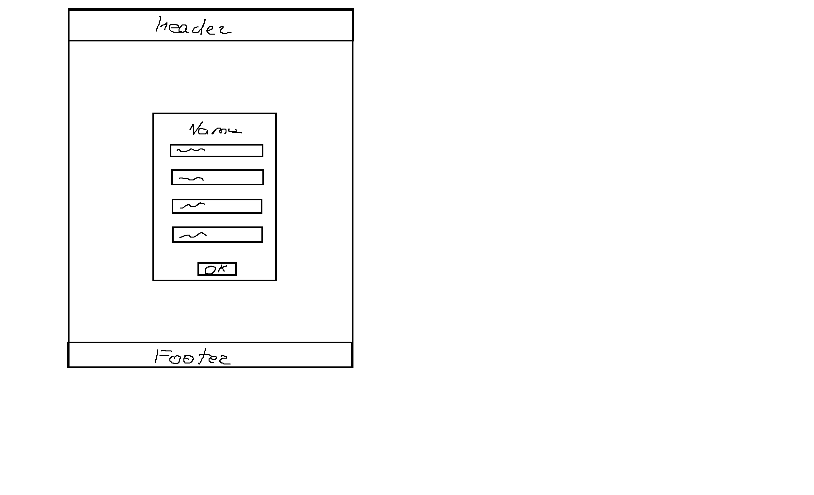

# Registration Form Project

This repository contains a solution for the web design task: creating a responsive registration page using semantic HTML, CSS, and JavaScript.

## 📋 Requirements

### Functional Requirements
1.  **User Inputs:** The user must be able to input the following data:
    * Username
    * Email
    * Password
    * Confirm Password
2.  **Data Validation:**
    * **Email Format:** The system must validate that the email is in a correct format (e.g., contains `@` and `.`).
    * **Password Matching:** The system must check if the "Password" and "Confirm Password" fields match before submission.
    * **Password Length:** The password must be at least 8 characters long.
3.  **Error Handling:** If validation fails, the form must not be submitted, and specific error messages must be displayed below the corresponding fields.
4.  **Success State:** If all data is valid, a success message ("Registration Successful") should appear, and the form should be reset.

### Non-functional Requirements
1.  **Usability:** The interface must be intuitive, with clear labels for all input fields.
2.  **Responsiveness:** The design must be adaptive, ensuring the form looks good on both desktop monitors and mobile devices.
3.  **Design Aesthetics:** The page utilizes a "Dark Mode" color scheme with high-contrast error messages for better readability.
4.  **Code Structure:**
    * **HTML** must be semantic (using `<header>`, `<main>`, `<section>`, `<form>`, `<footer>`).
    * **CSS** must be stored in an external file.
    * **JavaScript** must be stored in an external file and handle logic without inline scripts.

---

## 🎨 Page Design (Schema)

The layout follows a classic "Centered Card" structure to focus the user's attention on the registration task.

**Structure Description:**
1.  **Header:** Located at the top, contains the branding/title.
2.  **Main Container:**
    * Centers the content vertically and horizontally.
    * Contains the **Form Card**: A distinct container with a lighter background relative to the body, housing the input fields and the submit button.
    * **Feedback Area:** A dedicated space below the button for global messages (Success/Error).
3.  **Footer:** Located at the bottom, contains copyright information.

### Visual Layout Diagram
*(Below is the schema of the page layout)*

> *Note: The diagram above illustrates the wireframe of the solution.*

---

## 🛠 Technologies Used
* **HTML5:** Semantic markup.
* **CSS3:** Flexbox for layout, custom properties, and responsive design.
* **JavaScript (ES6):** DOM manipulation, Event handling (`submit`), and Regex validation.

## 🚀 How to Run
1.  Clone this repository or download the files.
2.  Open the `index.html` file in any modern web browser.
3.  Test the validation by trying to submit empty fields or mismatched passwords.
